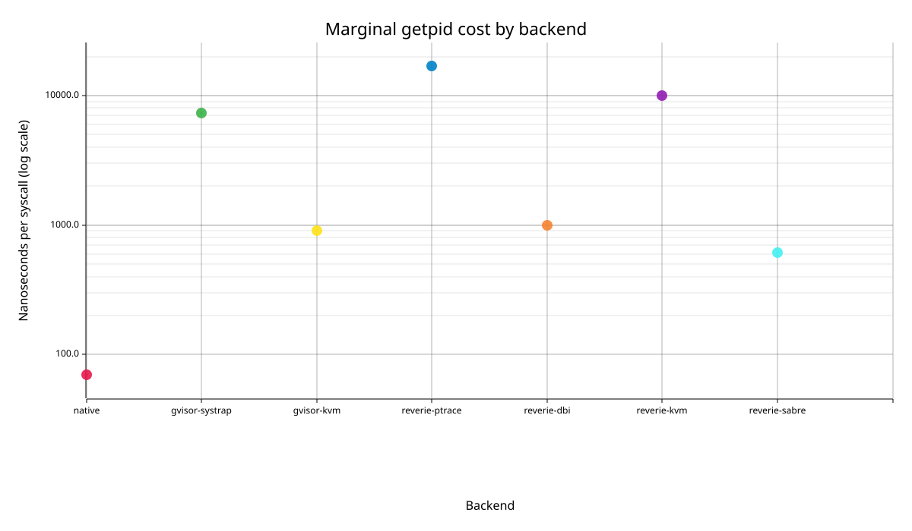
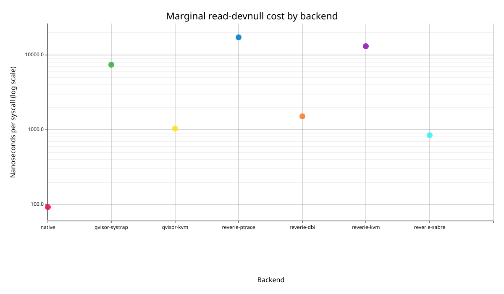

# Marginal syscall cost

Criterion linear-regression estimates. Units are nanoseconds per additional syscall; intervals are 95% confidence intervals.

Full Criterion HTML: `/tmp/criterion-counter1-v3-combined-20260726/report/index.html`.

Raw measured batches are in `raw-samples.tsv`; their batch-average medians are in `medians.tsv`. Regression slope is the primary marginal-cost statistic.

## `clock-gettime`

| Backend | ns/syscall | 95% CI | Statistic |
| --- | ---: | ---: | --- |
| native | 115.610 | 113.975-116.802 | slope |
| gvisor-systrap | 7209.173 | 7121.121-7300.354 | slope |
| gvisor-kvm | 1083.969 | 1073.389-1096.389 | slope |
| reverie-ptrace | 17072.594 | 16925.207-17197.815 | slope |
| reverie-dbi | 1171.914 | 1166.478-1180.948 | slope |
| reverie-kvm | 11058.252 | 11034.619-11087.307 | slope |
| reverie-sabre | 668.829 | 666.137-671.425 | slope |

## `getpid`

| Backend | ns/syscall | 95% CI | Statistic |
| --- | ---: | ---: | --- |
| native | 69.554 | 68.464-71.214 | slope |
| gvisor-systrap | 7305.646 | 7132.485-7508.248 | slope |
| gvisor-kvm | 911.084 | 904.959-916.668 | slope |
| reverie-ptrace | 16945.545 | 16880.530-17013.757 | slope |
| reverie-dbi | 1001.195 | 998.147-1004.378 | slope |
| reverie-kvm | 9965.556 | 9943.981-9996.991 | slope |
| reverie-sabre | 614.420 | 609.579-618.688 | slope |

## `read-devnull`

| Backend | ns/syscall | 95% CI | Statistic |
| --- | ---: | ---: | --- |
| native | 92.483 | 91.533-93.345 | slope |
| gvisor-systrap | 7438.116 | 7354.679-7508.922 | slope |
| gvisor-kvm | 1041.539 | 1032.682-1051.104 | slope |
| reverie-ptrace | 17310.645 | 17142.354-17465.778 | slope |
| reverie-dbi | 1521.385 | 1513.080-1529.048 | slope |
| reverie-kvm | 13183.877 | 13172.636-13193.331 | slope |
| reverie-sabre | 851.538 | 848.284-856.619 | slope |

## `write-devnull`

| Backend | ns/syscall | 95% CI | Statistic |
| --- | ---: | ---: | --- |
| native | 87.741 | 87.445-88.069 | slope |
| gvisor-systrap | 7138.565 | 7076.769-7202.960 | slope |
| gvisor-kvm | 1071.846 | 1066.044-1077.086 | slope |
| reverie-ptrace | 16760.377 | 16574.851-16922.329 | slope |
| reverie-dbi | 1222.492 | 1162.798-1294.752 | slope |
| reverie-kvm | 12705.703 | 12661.557-12802.081 | slope |
| reverie-sabre | 862.449 | 858.265-868.580 | slope |

Generated files: `/home/newton/work/dev-hermit/experiments/benchmark-v3/results`.
