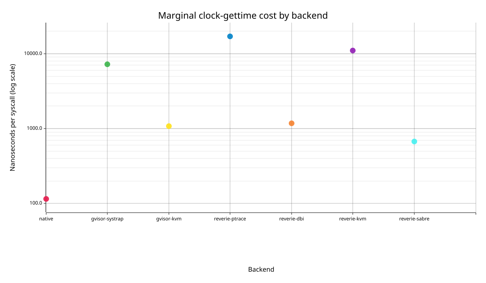

# Marginal syscall cost

Criterion linear-regression estimates. Units are nanoseconds per additional syscall; intervals are 95% confidence intervals.

Full Criterion HTML: `/tmp/criterion-counter1-v3-clock3-20260726/report/index.html`.

Raw measured batches are in `raw-samples.tsv`; their batch-average medians are in `medians.tsv`. Regression slope is the primary marginal-cost statistic.

## `clock-gettime`

| Backend | ns/syscall | 95% CI | Statistic |
| --- | ---: | ---: | --- |
| native | 115.610 | 113.975-116.802 | slope |
| gvisor-systrap | 7209.173 | 7121.121-7300.354 | slope |
| gvisor-kvm | 1083.969 | 1073.389-1096.389 | slope |
| reverie-ptrace | 17072.594 | 16925.207-17197.815 | slope |
| reverie-dbi | 1171.914 | 1166.478-1180.948 | slope |
| reverie-kvm | 11058.252 | 11034.619-11087.307 | slope |
| reverie-sabre | 668.829 | 666.137-671.425 | slope |

Generated files: `/home/newton/work/dev-hermit/experiments/benchmark-v3/results/runs/clock-gettime`.
