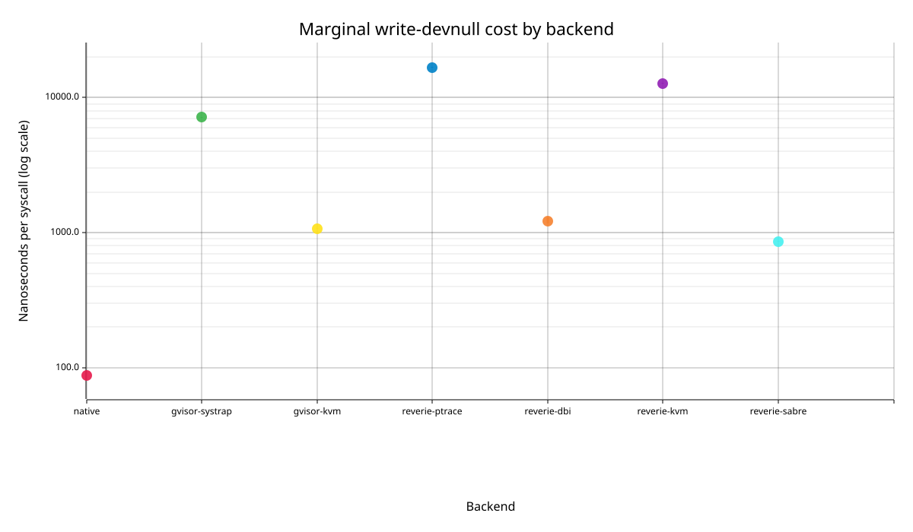

# Marginal syscall cost

Criterion linear-regression estimates. Units are nanoseconds per additional syscall; intervals are 95% confidence intervals.

Full Criterion HTML: `/tmp/criterion-counter1-v3-write3-20260726/report/index.html`.

Raw measured batches are in `raw-samples.tsv`; their batch-average medians are in `medians.tsv`. Regression slope is the primary marginal-cost statistic.

## `write-devnull`

| Backend | ns/syscall | 95% CI | Statistic |
| --- | ---: | ---: | --- |
| native | 87.741 | 87.445-88.069 | slope |
| gvisor-systrap | 7138.565 | 7076.769-7202.960 | slope |
| gvisor-kvm | 1071.846 | 1066.044-1077.086 | slope |
| reverie-ptrace | 16760.377 | 16574.851-16922.329 | slope |
| reverie-dbi | 1222.492 | 1162.798-1294.752 | slope |
| reverie-kvm | 12705.703 | 12661.557-12802.081 | slope |
| reverie-sabre | 862.449 | 858.265-868.580 | slope |

Generated files: `/home/newton/work/dev-hermit/experiments/benchmark-v3/results/runs/write-devnull`.
