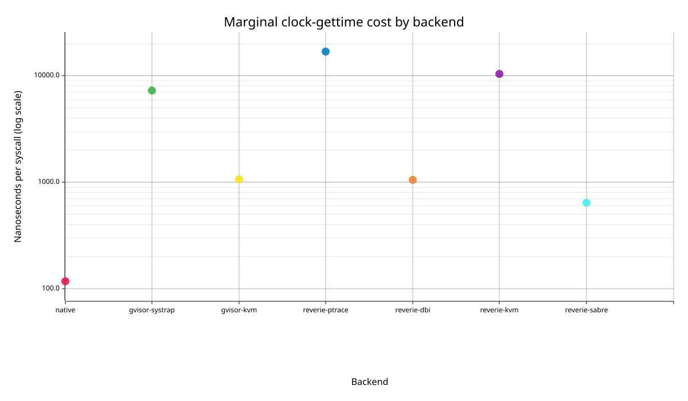
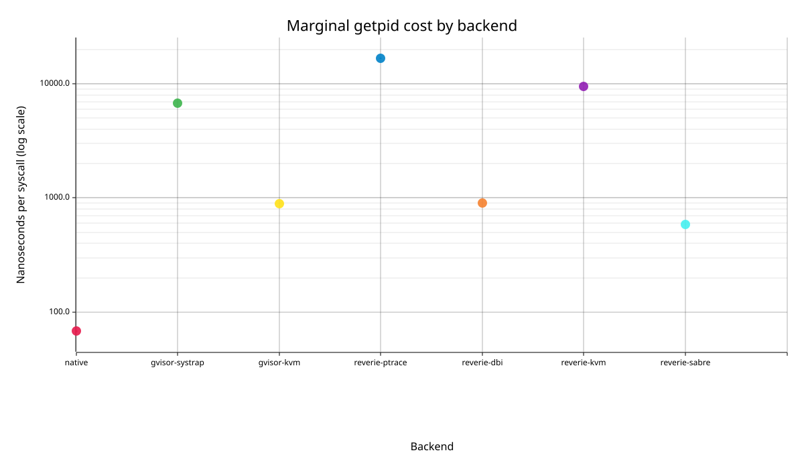
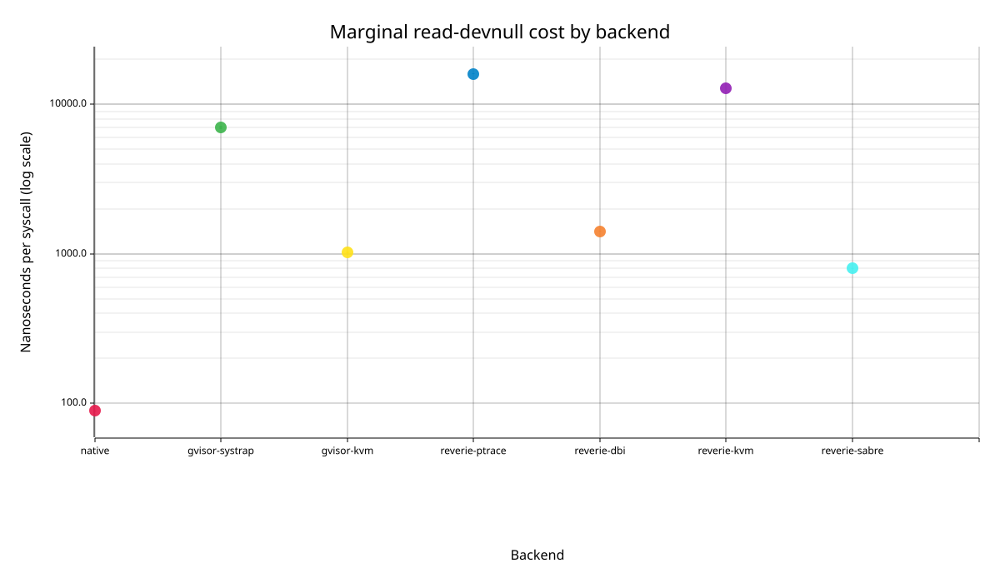
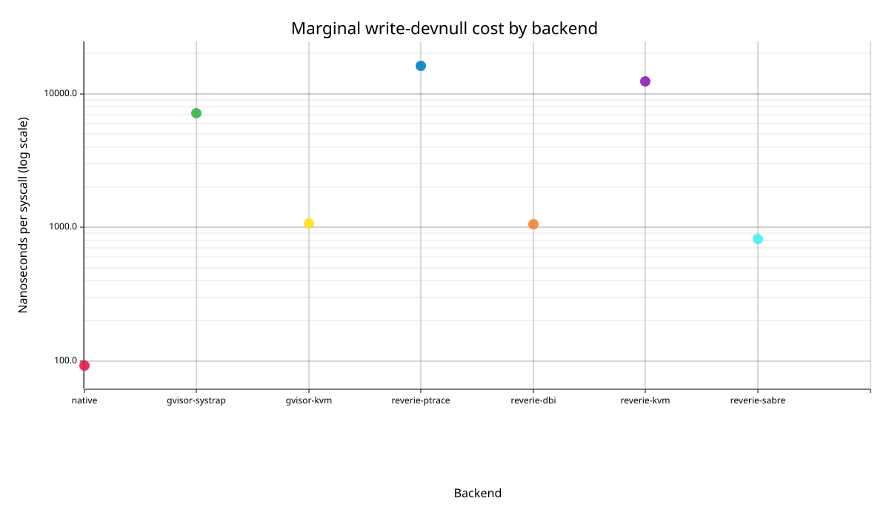

# Marginal syscall cost

Criterion linear-regression estimates. Units are nanoseconds per additional syscall; intervals are 95% confidence intervals.

Full Criterion HTML: `/tmp/criterion-v3-final-20260726-0718/report/index.html`.

## `clock-gettime`

| Backend | ns/syscall | 95% CI | Statistic |
| --- | ---: | ---: | --- |
| native | 116.686 | 114.766-118.642 | slope |
| gvisor-systrap | 7306.850 | 7285.316-7338.819 | slope |
| gvisor-kvm | 1072.545 | 1062.234-1082.690 | slope |
| reverie-ptrace | 17028.618 | 16932.728-17104.537 | slope |
| reverie-dbi | 1055.012 | 1053.841-1056.454 | slope |
| reverie-kvm | 10456.306 | 10431.368-10477.921 | slope |
| reverie-sabre | 637.922 | 636.944-638.715 | slope |

## `getpid`

| Backend | ns/syscall | 95% CI | Statistic |
| --- | ---: | ---: | --- |
| native | 68.415 | 66.941-69.450 | slope |
| gvisor-systrap | 6752.975 | 6726.802-6785.335 | slope |
| gvisor-kvm | 895.903 | 892.076-899.203 | slope |
| reverie-ptrace | 16714.112 | 16535.257-16866.893 | slope |
| reverie-dbi | 902.184 | 900.860-903.562 | slope |
| reverie-kvm | 9522.032 | 9516.100-9530.883 | slope |
| reverie-sabre | 583.345 | 581.768-584.848 | slope |

## `read-devnull`

| Backend | ns/syscall | 95% CI | Statistic |
| --- | ---: | ---: | --- |
| native | 89.019 | 88.365-89.588 | slope |
| gvisor-systrap | 7014.594 | 6839.725-7165.924 | slope |
| gvisor-kvm | 1026.957 | 1016.587-1037.106 | slope |
| reverie-ptrace | 16035.738 | 15937.778-16157.003 | slope |
| reverie-dbi | 1418.698 | 1409.459-1430.936 | slope |
| reverie-kvm | 12824.329 | 12799.451-12868.745 | slope |
| reverie-sabre | 797.961 | 790.690-805.467 | slope |

## `write-devnull`

| Backend | ns/syscall | 95% CI | Statistic |
| --- | ---: | ---: | --- |
| native | 92.696 | 92.597-92.789 | slope |
| gvisor-systrap | 7190.501 | 7040.398-7310.282 | slope |
| gvisor-kvm | 1070.461 | 1065.543-1075.267 | slope |
| reverie-ptrace | 16225.864 | 16132.413-16320.706 | slope |
| reverie-dbi | 1051.477 | 1048.327-1054.202 | slope |
| reverie-kvm | 12353.218 | 12319.726-12388.686 | slope |
| reverie-sabre | 821.086 | 817.428-823.535 | slope |

Generated files: `/home/newton/work/dev-hermit/experiments/gvisor-reverie-benchmark_20260725/v3-results`.
